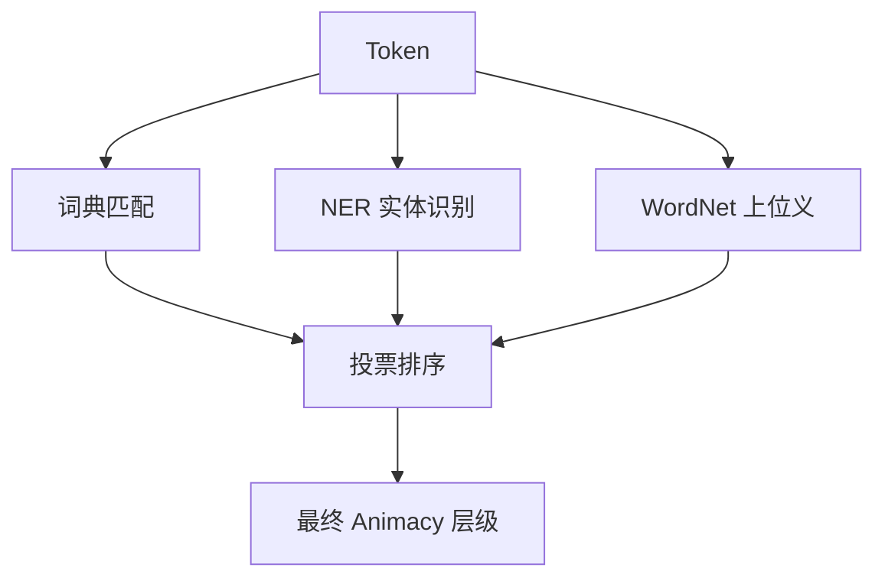

## 4 模块详细设计

这一章详细阐述基于 Animacy 的英文句式格标记重写系统的核心处理流程与各子模块实现方式。整体目标是在解析后的依存/成分信息基础上，依照三套标注方案（A/B/C）对句子进行规则化转换、格标记注入与语序调整。

---

### 4.1 预处理模块

| 步骤 | 说明 |
|------|------|
| **文本规范化** | 替换花式引号（“”‘’→""''），标准化破折号与连字符，移除重复空格 |
| **句子切分** | 首选 `spaCy` 的 `senter` 组件；若失败则回退正则 `(?<=[.?!])\s+` |

---

### 4.2 语言学解析模块

| 功能 | 工具 | 输出 |
|------|------|------|
| 分词 / 词性 / 依存 | **spaCy `en_core_web_trf`** | token 列表 + 依存图 |
| 成分结构 | **BenePar (bert‑base)** | 成分树 (识别从句、VP/NP) |
| 共指消解 | **coreferee / neuralcoref** | 替换 *it/that/who* 等指代 |
| 语义角色标注 (SRL) | **AllenNLP v2** | Verb 的 Arg0 (AGE) / Arg1 (PAT) |

解析目的：

* 识别主语 (nsubj / nsubjpass)、宾语 (dobj, obj)  
* 检测被动语态 (`auxpass`, `nsubjpass`)  
* 找到从句边界 (`ccomp`, `xcomp`, `relcl`)  
* 标定不定式 (`xcomp` + `mark=to`) 与动名词 (`VBG`)  

---

### 4.3 Animacy & Definiteness 判定模块



**判定优先级**

1. **NER 类型**：`PERSON → Human`, `ANIMAL → Animal`, `ORG → Abstract`, `GPE → Movable`  
2. **手工词典**：收录常见动物、车辆、家具等 5 k+ 词条  
3. **WordNet supersense**：`noun.animal`, `noun.artifact`, `noun.event` …  
4. **分布式语义**：fastText 最近邻类别投票 (置信度 < 0.5 标记 Unknown)

> *Definiteness*（可选）：根据冠词/指示词判断特指性，用于处理同层级冲突。

---

### 4.4 规则引擎模块

1. **CaseMarkerInjector — 施事/受事格标记注入**

   * 按 Animacy 层级 + 依存角色分配 `AGE` / `PAT`
   * 格标记紧随名词 token 插入

   ```plaintext
   The cat age bit the dog pat.
   ```

2. **PassiveToActive — 被动语态转换**

   | 场景 | 转换 |
   |------|------|
   | 有 `agent` | `by‑phrase` 提至主语，动词还原主动 |
   | 无 `agent` | 仅保留 PAT，省略缺失 AGE |

3. **ClauseNominalizer — 从句名物化**

   * 处理 `ccomp`, `xcomp`, `relcl`, 不定式 `to V`, 动名词 `V‑ing`
   * 删除功能词 *that, to, who* 等，子句尾部附 `NMLZ`

4. **WordOrderTransformer (Scheme C)**

   * 依存图 TopoSort 将 SVO→SOV  
   * 保持修饰语靠近被修饰语

5. **RelativeClausePreposer (Scheme C)**

   * 将 `relcl` 子树前置于被修饰名词前  
   * 子树整体尾部添加 `NMLZ`

6. **FunctionWordStripper**

   * 删除系动词 (*is, are, was*)  
   * 删除 *that, which, whom*, 不定式标记 *to*, 现在分词后缀 *‑ing* 等

---

### 4.5 输出线性化器

* 依据重写后的依存图 DFS 生成 token 序列  
* `AGE`/`PAT` 紧跟名词，`NMLZ` 位于名物化子句末尾  
* Token 之间单空格分隔，标点符号紧贴前一个非标记 token

示例 (Scheme C)：

```plaintext
bit the dog PAT NMLZ the cat AGE the boy PAT saw .
```

---
